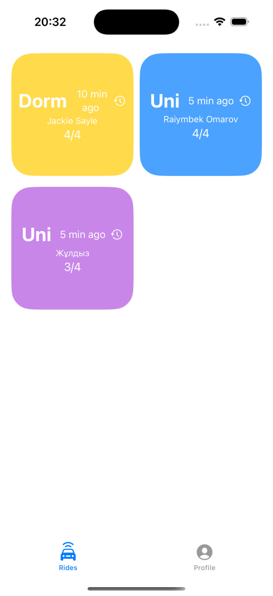
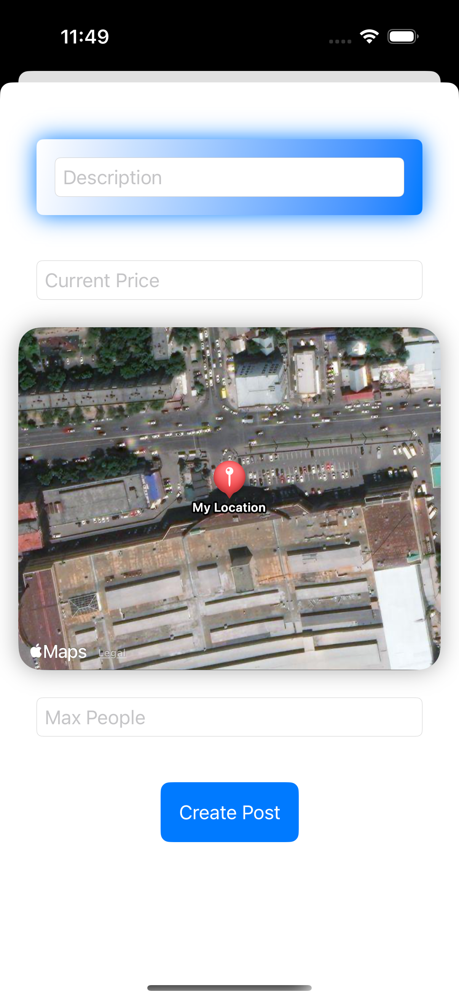

# LoginForm
<a href="https://github.com/blendereru/LoginForm/blob/6bafb0d7e5eea91c3371e97b5972ffca8d46fe94/.github/workflows/dotnet.yml"></a>
<a href="https://dotnet.microsoft.com/en-us/"></a>
<a href="https://www.swift.org/"></a>
[](https://opensource.org/licenses/MIT)

The process of sign-in, sign-up in mobile-app. It uses `Swift` and `ASP.NET Core` for client and server interaction, and is available
in `Apple` devices. 
## Demos
### Home Screen & Post Creation Page
<div style="display: flex; gap: 20px;">
  
  
</div>

## 🏗️ Architecture
This project follows the MVVM (Model-View-ViewModel) architecture pattern with SwiftUI for the user interface and Combine for reactive data binding.

## Setup for the app
    • Xcode (version 15 or later)
    • macOS (version 12 or later)

## 📦 Dependencies
    • Combine: Reactive programming framework for data binding.
    • CoreLocation: For location services and retrieving the user’s location.
    • MapKit: For map view and geolocation-related functionality.
    • SignalRCleint: For websocket implementation
## Endpoints
`Server-side` defines multiple `endpoints` for client to send requests to. 
* `/api/signup` - is needed to register new user in a database
* `/api/userhub?userName=<your_userName>` - this is where the client and the server set connection with hub(SignalR).
This endpoint is needed to notify the client when the user confirms his email.
* `/api/confirm-email` - is needed to confirm user's email.
* `/api/signin` - is needed to log an existing user in the system. Doesn't allow to sign in until the `email` is confirmed.
### Endpoints for authorized users `only`
* `/api/post/create` - the endpoint to create a `post` and make it visible for all users.
* `/api/post/update` - is needed to update the post settings.
* `/api/post/read/{id}` - is needed to retrieve the information about specific post.
* `/api/post/join/{id}` - is needed to join the specific post. Marks the current user as a `member`.
* `/api/post/delete` - is needed to delete the existing post.
* `/api/post/read` - to read all posts.
* `/api/posthub` - is needed to notify `all the connected clients` about the post that was created.

## 🚨 Requirements
To use this project, ensure the following requirements are met:
1. A running instance of `SQL Server` (local or remote). Update the `ConnectionStrings:IdentityConnection` in the
`appsettings.json` file with your `SQL Server` details:
```json
"ConnectionStrings": {
  "IdentityConnection": "Data Source=your-server-name;Initial Catalog=your-database-name;Integrated Security=True;"
}
```
2. Register your application with `Google` to enable `OAuth2` login. Obtain your `ClientId` and `ClientSecret` from the `Google Cloud Console` and
update the following section in `appsettings.json`:
```json
"GoogleServices": {
  "ClientId": "your-client-id",
  "ClientSecret": "your-client-secret"
}
```
3. Configure `email` settings for sending confirmation emails. Use a valid `SMTP` provider such as `Gmail`. Then
update the `EmailSettings` section in the `appsettings.json` file:
```json
"EmailSettings": {
  "MailServer": "smtp.gmail.com",
  "MailPort": 587,
  "SenderName": "email-identity",
  "FromEmail": "your-email@gmail.com",
  "Password": "your-email-password"
}
```
If you're using Gmail, use an [App Password](https://support.google.com/accounts/answer/185833?hl=en). 
## 🎯 ToDos
1. [ ] Ask to confirm `email` after `/api/signin` to ensure the right user is logging in.
2. [ ] Add persistent storage in client-side(post IDs) to ensure the client can read info about posts.
3. [ ] Add endpoints to handle the case when user's data changes. For example, client forgot his `password`.
4. [ ] Modify the `UI` for better appearance.
5. [ ] Decrease the `latency` in server-side.
## 📗 License
The project code and all the resources are distributed under the terms of [MIT license](https://github.com/blendereru/LoginForm/blob/f9ec9cd269e0b785c8a7b778e4d4f16fdb4a1427/LICENSE)

